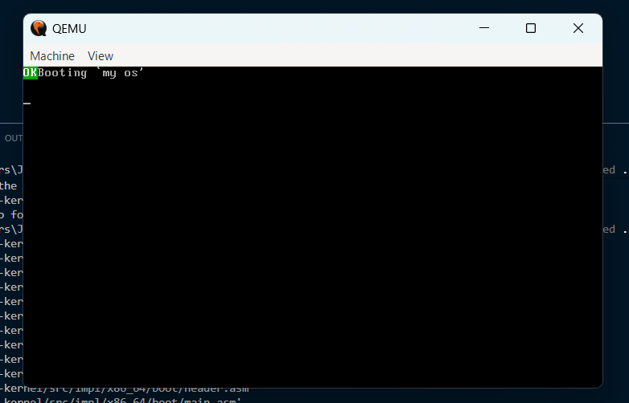
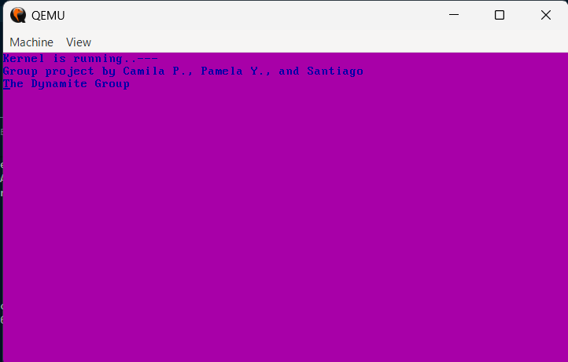

Command to move to where I am working: cd integrative-project-distro-kernel-lab/part2-kernel
command to build the Docker image: docker build -t myos-buildenv .
command to enter Docker:  docker run --rm -it -v ${PWD}:/root/env myos-buildenv
command to modify code files: make build-x86_64 
command to exit Docker: exit
command to enter qemu: & "C:\Program Files\qemu\qemu-system-x86_64.exe" -cdrom dist/x86_64/kernel.iso
qemu working:

qemu working now with 64 bits

custom kernel message: 
