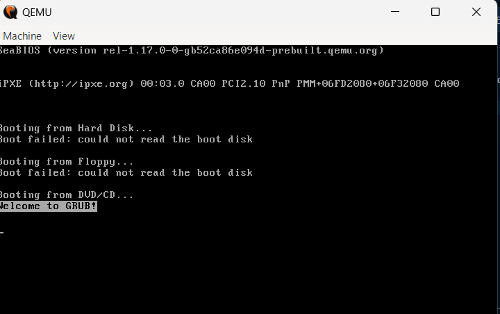
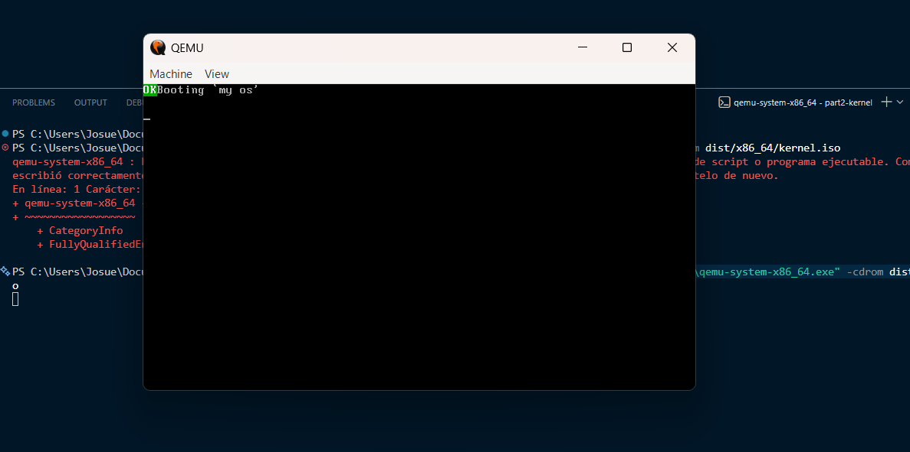

command to enter Docker:  docker run --rm -it -v ${PWD}:/root/env myos-buildenv
command to modify code files: make build-x86_64 
command to enter qemu: & "C:\Program Files\qemu\qemu-system-x86_64.exe" -cdrom dist/x86_64/kernel.iso
qemu working:

