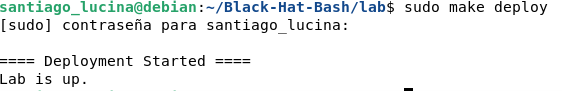
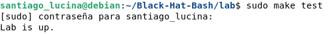
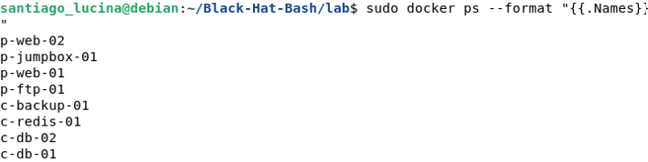
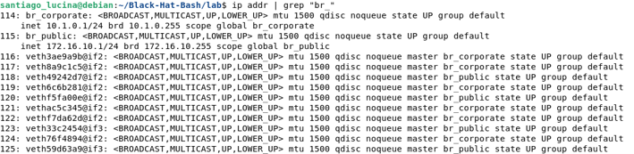
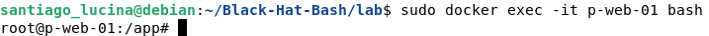

# Section A

## Deployment & Verification Screenshots

This section presents the visual evidence and logs verifying that the lab environment was correctly deployed, all functional test suites passed, the network topology is intact, and the services are operational.

### 1. Lab Deployment (`make deploy`)

Below is the execution log confirming the automated build and deployment of the lab architecture:



### 2. Verification Tests (`make test`)

Confirmation log showing that the validation suite successfully ran and all integrity tests passed (*Lab is up*):



### 3. Container Status (`docker ps`)

Listing of the 8 active and running microservices/containers composing the core architecture:



### 4. Host Network Configuration (`ip addr`)

System network interface properties confirming the correct bindings for both the Public (`172.16.10.0/24`) and Corporate (`10.1.0.0/24`) subnets:



### 5. Interactive Container Access Verification (`docker exec`)

Container shell context verification confirming administrative root access inside the isolated front-end infrastructure application directory:



## Lab Network Architecture

This repository contains the technical topology specifications of the lab infrastructure, detailing the IP configurations and network segmentation mapping across public and corporate boundaries.

### 1. Addressing Table

| Machine / Hostname | Public IP (`172.16.10.0/24`) | Corporate IP (`10.1.0.0/24`) | Segment Type |
| :--- | :--- | :--- | :--- |
| **p-web-01** | `172.16.10.10` | *N/A* | Public Only |
| **p-ftp-01** | `172.16.10.11` | *N/A* | Public Only |
| **p-web-02** | `172.16.10.12` | `10.1.0.11` | Dual-Homed (Bridge) |
| **p-jumpbox-01**| `172.16.10.13` | `10.1.0.12` | Dual-Homed (Bridge) |
| **c-backup-01** | *N/A* | `10.1.0.13` | Corporate Only |
| **c-redis-01** | *N/A* | `10.1.0.14` | Corporate Only |
| **c-db-01** | *N/A* | `10.1.0.15` | Corporate Only |
| **c-db-02** | *N/A* | `10.1.0.16` | Corporate Only |

---

### 2. Two-Network Diagram

Hosts prefixed with `p-` reside on or face the external Public zone, while hosts prefixed with `c-` are securely isolated within the internal Corporate network core. The systems p-web-02 and p-jumpbox-01 act as *Dual-Homed* bridges interconnecting both layers.

```text
       PUBLIC NETWORK (DMZ)                     CORPORATE NETWORK
          172.16.10.0/24                          10.1.0.0/24
   ┌──────────────────────────┐          ┌──────────────────────────┐
   │                          │          │                          │
   │  [p-web-01] .10          │          │          .13 [c-backup-01]
   │                          │          │                          │
   │  [p-ftp-01] .11          │          │          .14 [c-redis-01]  │
   │                          │          │                          │
   │                    ┌─────┴──────────┴─────┐    .15 [c-db-01]   │
   │  Eth0: .12 ────────┤      p-web-02        ├──────── Eth1: .11  │
   │                    └─────┬──────────┬─────┘    .16 [c-db-02]   │
   │                    ┌─────┴──────────┴─────┐                    │
   │  Eth0: .13 ────────┤    p-jumpbox-01      ├──────── Eth1: .12  │
   │                    └─────┬──────────┬─────┘                    │
   │                          │          │                          │
   └──────────────────────────┘          └──────────────────────────┘