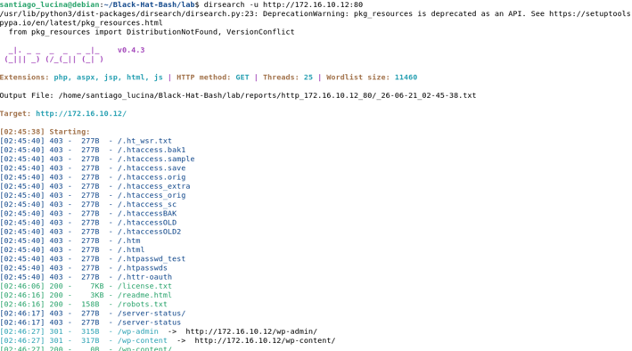
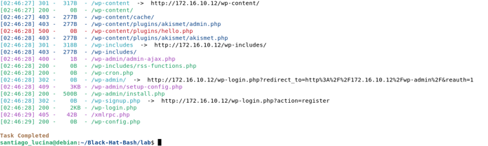

# Section A

## Deployment & Verification Screenshots

This section presents the visual evidence and logs verifying that the lab environment was correctly deployed, all functional test suites passed, the network topology is intact, and the services are operational.

### 1. Lab Deployment (`make deploy`)

Below is the execution log confirming the automated build and deployment of the lab architecture:


### 2. Verification Tests (`make test`)

Confirmation log showing that the validation suite successfully ran and all integrity tests passed (*Lab is up*):


### 3. Container Status (`docker ps`)

Listing of the 8 active and running microservices/containers composing the core architecture:


### 4. Host Network Configuration (`ip addr`)

System network interface properties confirming the correct bindings for both the Public (`172.16.10.0/24`) and Corporate (`10.1.0.0/24`) subnets:


### 5. Interactive Container Access Verification (`docker exec`)

Container shell context verification confirming administrative root access inside the isolated front-end infrastructure application directory:


## Lab Network Architecture

This repository contains the technical topology specifications of the lab infrastructure, detailing the IP configurations and network segmentation mapping across public and corporate boundaries.

### 1. Addressing Table

| Machine / Hostname | Public IP (`172.16.10.0/24`) | Corporate IP (`10.1.0.0/24`) | Segment Type |
| :--- | :--- | :--- | :--- |
| **p-web-01** | `172.16.10.10` | *N/A* | Public Only |
| **p-ftp-01** | `172.16.10.11` | *N/A* | Public Only |
| **p-web-02** | `172.16.10.12` | `10.1.0.11` | Dual-Homed (Bridge) |
| **p-jumpbox-01**| `172.16.10.13` | `10.1.0.12` | Dual-Homed (Bridge) |
| **c-backup-01** | *N/A* | `10.1.0.13` | Corporate Only |
| **c-redis-01** | *N/A* | `10.1.0.14` | Corporate Only |
| **c-db-01** | *N/A* | `10.1.0.15` | Corporate Only |
| **c-db-02** | *N/A* | `10.1.0.16` | Corporate Only |

---

### 2. Two-Network Diagram

Hosts prefixed with `p-` reside on or face the external Public zone, while hosts prefixed with `c-` are securely isolated within the internal Corporate network core. The systems p-web-02 and p-jumpbox-01 act as *Dual-Homed* bridges interconnecting both layers.

```text
        PUBLIC NETWORK                         CORPORATE NETWORK
        172.16.10.0/24                            10.1.0.0/24
   ┌──────────────────────────┐          ┌──────────────────────────┐
   │                          │          │                          │
   │  [p-web-01] .10          │          │         .13 [c-backup-01]| 
   │                          │          │                          │
   │  [p-ftp-01] .11          │          │        .14 [c-redis-01]  │
   │                          │          │                          │
   │                    ┌─────┴──────────┴─────┐    .15 [c-db-01]   │
   │  Eth0: .12 ────────┤      p-web-02        ├──────── Eth1: .11  │
   │                    └─────┬──────────┬─────┘    .16 [c-db-02]   │
   │                    ┌─────┴──────────┴─────┐                    │
   │  Eth0: .13 ────────┤    p-jumpbox-01      ├──────── Eth1: .12  │
   │                    └─────┬──────────┬─────┘                    │
   │                          │          │                          │
   └──────────────────────────┘          └──────────────────────────┘
   ```


# Section B

## Hacking Technique in the Lab: Directory/Path Enumeration via dirsearch

### 1. Command Executed

To perform this technique from the Debian host, the following command was used against the responsive target:
```bash
dirsearch -u [http://172.16.10.12:80](http://172.16.10.12:80)
```




### 2. What the technique does?

Directory/Path Enumeration is like a guessing game for hidden pages. Instead of clicking links on a website, a tool (dirsearch) automatically requests thousands of common page names (like /admin, /login, or /secret) from a wordlist at a very high speed to see which ones actually exist on the server.

### 3. Why it works?

Our initial attempt against p-web-01 (172.16.10.10) failed immediately with a "Cannot connect" error. Even though the application server is active on port 5000 inside the Docker network, Docker does not expose or map this port to the external host bridge. It is completely locked within the internal perimeter, blocking the local dirsearch script from opening an HTTP connection socket.

To bypass this limitation without changing the methodology, we targeted p-web-02 (172.16.10.12). This host is explicitly configured as a Dual-Homed system. Because it is Dual-Homed, it has an active network interface facing the public bridge network with port 80 exposed. This open window allowed the local tool to connect directly, route the traffic, and perform the scan successfully.

### 4. What information was obtained?

The tool analyzed the numbers (HTTP status codes) sent back by the server, giving us important information about the laboratory's structure:

* **CMS Identification (301/302 Redirects & 200 OK):** The scan discovered critical paths such as /wp-admin, /wp-login.php, and /wp-content. In web infrastructure, any path starting with wp- stands for WordPress. This proves with 100% certainty that this web server is running a WordPress deployment.

* **Exposed Public Files (200 OK):** Flat files like /robots.txt and /readme.html are completely open and readable. The robots.txt file is highly valuable for a security audit because it lists paths the administrator explicitly wanted to hide from web crawlers, inadvertently handing us a roadmap of internal directories.

* **Access Control Blocks (403 Forbidden):** Paths like /.htaccess or /wp-content/cache/ exist on the system, confirming the file structure is present, but the server configuration safely restricts the access from reading them.

